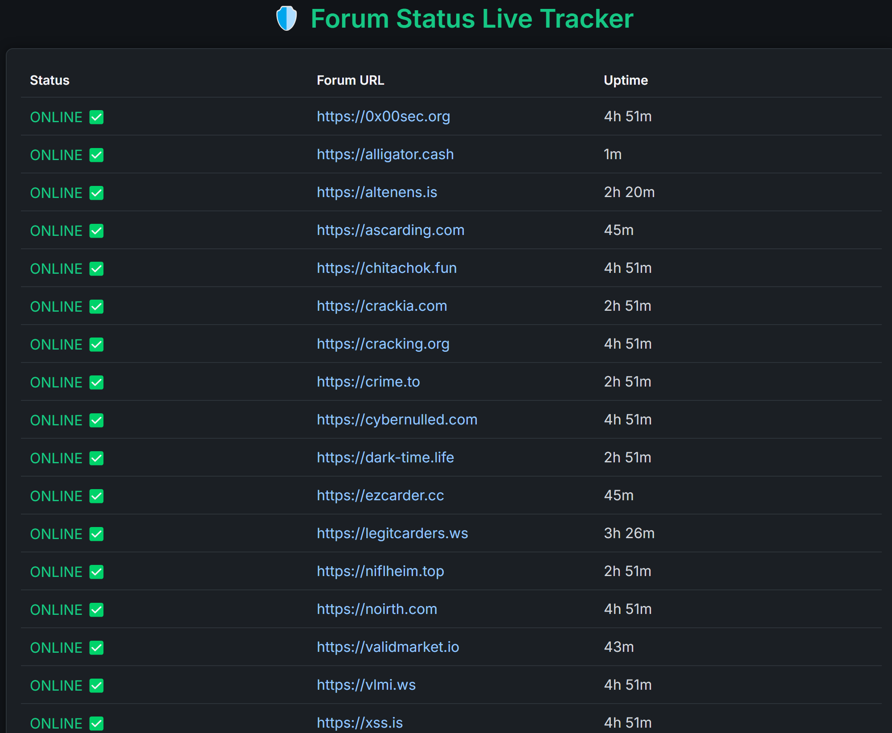
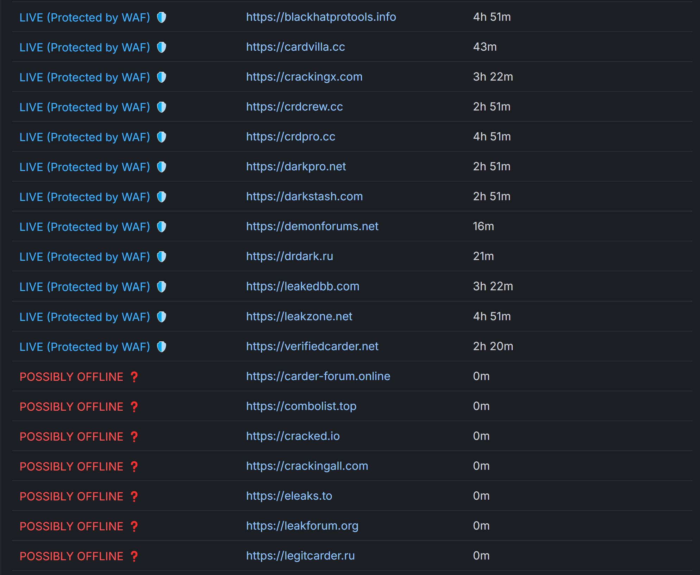

# threat_actor_forum_tracker

A basic background service that tracks threat actor forums based on their HTTP/HTTPS status codes and HTML content via pattern matching.

https://threat.pipelinetest.com.tr/


## 📌 Visual Components


### Dashboard


### Filters



## 📌 Overview
`threat_actor_forum_tracker` is designed to monitor the online status of underground forums. It checks whether specific forums are **online**, **protected**, or **offline** by:
- Sending HTTP/HTTPS requests
- Analyzing status codes (e.g., 200, 403, 503)
- Pattern matching within the HTML responses to detect custom protection mechanisms (like DDoS protection, maintenance pages, etc.)

## 🚀 Features
- **Background Monitoring**: Continuously runs in the background to track forums.
- **Status Detection**: Identifies if a forum is online, protected (WAF/Cloudflare), or offline.
- **Custom Pattern Matching**: Matches HTML content to detect non-standard protection pages.
- **Real-Time Updates**: Can be integrated with messaging bots (like Telegram) for instant alerts.

## 🛠️ Usage
1. Clone the repository:
    ```bash
    git clone https://github.com/yourusername/threat_actor_forum_tracker.git
    cd threat_actor_forum_tracker
    ```
2. Install the required Python packages:
    ```bash
    pip install -r requirements.txt
    ```
3. Configure your target forum list inside `forums.txt` or the relevant configuration file.
4. Run the tracker:
    ```bash
    python monitor_forums.py
    ```

## 📄 Requirements
- Python 3.8+
- Requests
- BeautifulSoup4

(Optionally: a Telegram Bot Token for notifications)

## ✨ Future Enhancements
- Proxy support
- More detailed offline reason detection (e.g., domain expired vs. server down)
- Web-based dashboard for monitoring

## 📜 License
This project is licensed under the MIT License.
